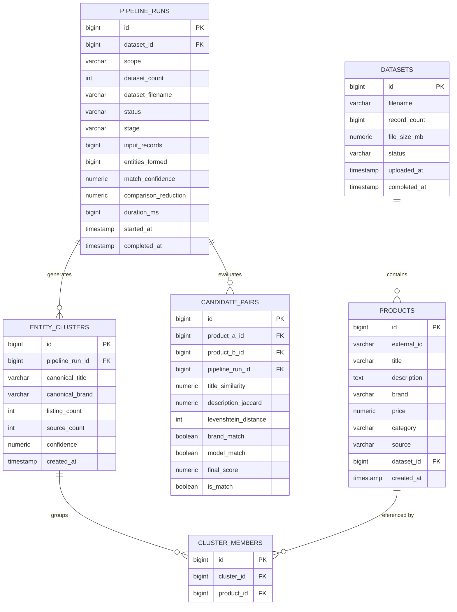

# RESOLVE — High-Performance E-Commerce Product Entity Resolution Platform

> An end-to-end, deterministic entity resolution and catalog deduplication engine built with **Spring Boot 3 (Java 17/21)**, **React 19 + TypeScript + Vite**, and **PostgreSQL (Supabase)**.

---

## Table of Contents

1. [Project Overview](#1-project-overview)
2. [Prerequisites](#2-prerequisites)
3. [Getting Started (Step-by-Step)](#3-getting-started---step-by-step)
4. [Project Folder Structure](#4-project-folder-structure)
5. [Architecture](#5-architecture)
6. [Complete API Reference](#6-complete-api-reference)
7. [The Algorithm Pipeline (Step-by-Step)](#7-the-algorithm-pipeline---step-by-step)
8. [Database Schema](#8-database-schema)
9. [Frontend Pages & Features](#9-frontend-pages--features)
10. [Algorithm Pages (Interactive Demos)](#10-algorithm-pages-interactive-demos)
11. [Configuration](#11-configuration)
12. [Mock Datasets & Test Data](#12-mock-datasets--test-data)
13. [Known Limitations](#13-known-limitations)

---

## 1. Project Overview

### The Real-World Problem
Modern e-commerce aggregators and retailers ingest product catalogs from multiple competing marketplaces (e.g., Amazon, Flipkart, eBay, Walmart, Target). Because each seller uses varied naming conventions, typos, abbreviations, and formatting, identical physical products appear under completely distinct product titles, descriptions, and prices:
- *"Apple iPhone 15 Pro (128 GB) - Natural Titanium"* (Amazon)
- *"Apple iPhone 15 Pro 128GB Natural Titanium 5G"* (Flipkart)
- *"Apple iPhone 15 Pro - 128GB - Natural Titanium (Unlocked)"* (eBay)

Evaluating all pairs via brute-force pairwise string comparison requires $\mathcal{O}(N^2)$ comparisons. For $N = 100{,}000$ products, that is $\approx 5 \times 10^9$ comparisons, which is computationally intractable in production environments.

### What RESOLVE Does
RESOLVE implements a multi-stage Data Structures and Algorithms (DSA) pipeline that solves this problem:
1. **Keyword Filtering ($\mathcal{O}(L)$ Trie)**: Prunes stop-words and normalizes title tokens.
2. **Candidate Blocking ($\mathcal{O}(N \log N)$ Suffix Array + Kasai LCP & Inverted Index)**: Filters the comparison space by $>80\%$, generating candidate pairs without evaluating irrelevant combinations.
3. **Multi-Signal Similarity Scoring**: Blends Knuth-Morris-Pratt (KMP) exact substring searching, Rabin-Karp rolling double-hashing, Wagner-Fischer Levenshtein dynamic programming distance, and token Jaccard overlap into a weighted confidence metric.
4. **Graph Clustering ($\mathcal{O}(\alpha(N))$ Disjoint Set Union & Min-Heap Priority Queue)**: Connects match edges into canonical entities with path compression and rank optimization, ranking clusters by statistical confidence.

### Core Technology Stack
- **Frontend**: React 19, TypeScript, Vite 8, Tailwind CSS, Recharts, Lucide React, Radix UI.
- **Backend**: Spring Boot 3.3.4, Java 17/21 bytecode target, Spring Data JPA, Hibernate 6, HikariCP.
- **Database**: PostgreSQL 15+ (hosted on Supabase Cloud Pooler with SSL).
- **Build Tools**: Bundled Apache Maven 3.9.6, Node.js / npm.

---

## 2. Prerequisites

| Requirement | Supported Version | Notes |
| :--- | :--- | :--- |
| **Java Development Kit (JDK)** | JDK 17 or JDK 21+ | Required to run Spring Boot (`java -version`). |
| **Node.js** | Node 18.x, 20.x, or 22.x | Required for the Vite frontend (`node -v`). |
| **Apache Maven** | Bundled (`tools/maven/`) | **No installation required**. A dedicated Maven binary is bundled with the project. |
| **Database (PostgreSQL)** | Cloud-Hosted (Supabase) | **No local PostgreSQL installation required**. Connection string is pre-configured. |
| **Web Browser** | Modern Browser | Chrome, Edge, Firefox, or Safari with JavaScript enabled. |

---

## 3. Getting Started - Step by Step

### Step 1: Clone or Open the Workspace
Ensure your terminal is in the root directory:
```bash
cd "Project"
```

---

### Step 2: Start the Spring Boot Backend

#### On Windows (PowerShell / Command Prompt):
```powershell
cd backend
.\tools\maven\apache-maven-3.9.6\bin\mvn.cmd spring-boot:run
```

#### On macOS / Linux:
```bash
cd backend
chmod +x ./tools/maven/apache-maven-3.9.6/bin/mvn
./tools/maven/apache-maven-3.9.6/bin/mvn spring-boot:run
```

#### Confirmation:
When the backend starts successfully, the terminal will log:
```text
[INFO] Started ResolveApplication in 3.842 seconds (process running for 4.512)
[INFO] [TRIE] Pre-loaded 22 stop-words into Trie for O(L) keyword filtration
[INFO] [MILLER-RABIN] Testing p=1000000007 -> prime confirmed, using as hash modulus
```
The backend server listens on `http://localhost:8080`.

---

### Step 3: Start the Vite Frontend

Open a new terminal window:
```bash
cd entity-iq
npm install
npm run dev
```

#### Confirmation:
```text
  VITE v8.3.0  ready in 240 ms

  ➜  Local:   http://localhost:5173/
  ➜  Network: use --host to expose
```
Open **`http://localhost:5173`** in your browser.

---

### Step 4: First-Run Workflow
1. Navigate to **Catalog** (`/datasets`) in the sidebar.
2. Click **Upload Dataset** and select the 3 CSV files from the `mock csv/` directory (`mock_appliances.csv`, `mock_electronics.csv`, `mock_mixed_catalog.csv`).
3. Navigate to **Run** (`/pipeline`) in the sidebar.
4. Click **Start New Run** (runs across all uploaded datasets).
5. Watch the real-time progress bar transition through `TOKENIZATION` $\to$ `CANDIDATE_BLOCKING` $\to$ `SIMILARITY_SCORING` $\to$ `CLUSTERING` $\to$ `COMPLETE`.
6. Explore the generated clusters under **Results** (`/entities`), pairwise match breakdowns under **Compare** (`/compare`), and analytics under **Analytics** (`/analytics`).

---

## 4. Project Folder Structure

```text
Project/
├── backend/                                  # Spring Boot 3 Java Backend
│   ├── pom.xml                               # Maven project configuration & dependencies
│   ├── tools/maven/                          # Bundled portable Apache Maven 3.9.6
│   └── src/
│       ├── main/
│       │   ├── java/com/resolve/
│       │   │   ├── ResolveApplication.java   # Main Spring Boot Entry Point (@SpringBootApplication)
│       │   │   ├── config/                   # Configuration Beans
│       │   │   │   ├── AsyncConfig.java      # Pipeline thread pool executor (4-8 threads)
│       │   │   │   ├── CacheConfig.java      # Spring CacheManager configuration
│       │   │   │   ├── CorsConfig.java       # Cross-Origin Resource Sharing filters
│       │   │   │   └── GlobalExceptionHandler.java # REST API exception mappings
│       │   │   ├── controller/               # REST API Endpoints
│       │   │   │   ├── AdminController.java  # Fast DB truncate and sequence reset (/api/admin/clear-all)
│       │   │   │   ├── DatasetController.java# CSV file upload, listing, deletion
│       │   │   │   ├── EntityController.java # Resolved entity clusters & member pagination
│       │   │   │   ├── ExportController.java # CSV streaming exports for clusters & pairs
│       │   │   │   ├── MatchController.java  # Candidate pair scores & inspection
│       │   │   │   ├── PipelineController.java # Pipeline triggers & execution polling
│       │   │   │   ├── SimilarityController.java # Interactive string metric testing API
│       │   │   │   └── StatsController.java  # Aggregated metrics & algorithm counters
│       │   │   ├── dto/                      # Data Transfer Objects & JSON Schemas
│       │   │   ├── model/                    # JPA Entities mapped to PostgreSQL tables
│       │   │   │   ├── CandidatePair.java    # Pairwise comparison record & similarity scores
│       │   │   │   ├── ClusterMember.java    # Membership mapping product -> entity cluster
│       │   │   │   ├── Dataset.java          # Uploaded catalog metadata
│       │   │   │   ├── EntityCluster.java    # Canonical cluster record
│       │   │   │   ├── PipelineRun.java      # Pipeline run lifecycle & statistics
│       │   │   │   └── Product.java          # Ingested product item listing
│       │   │   ├── repository/               # Spring Data JPA Repositories
│       │   │   └── service/                  # Business Logic & Core Algorithms
│       │   │       ├── CsvIngestionService.java # Apache Commons CSV parsing & DB batching
│       │   │       └── algorithm/            # Core DSA Resolution Engines
│       │   │           ├── AlgorithmMetricsTracker.java # In-memory operation counter
│       │   │           ├── AlgorithmPipelineService.java# 5-stage orchestration orchestrator
│       │   │           ├── BlockingService.java  # Suffix Array, Kasai LCP & Inverted Index
│       │   │           ├── ClusteringService.java# DSU with Path Compression & Max-Heap ranking
│       │   │           ├── SimilarityService.java# KMP, Rabin-Karp, Levenshtein, Jaccard
│       │   │           └── TokenizerService.java # Trie-based stopword filtration
│       │   └── resources/
│       │       └── application.properties    # PostgreSQL connection, HikariCP, and JPA config
│
├── entity-iq/                                # React 19 + TypeScript + Vite Frontend
│   ├── package.json                          # Frontend dependencies & build scripts
│   ├── vite.config.ts                        # Vite bundler config with /api reverse proxy
│   ├── src/
│   │   ├── App.tsx                           # React Router route registry & CacheProvider
│   │   ├── main.tsx                          # DOM mount point
│   │   ├── index.css                         # Design system, CSS variables & typography
│   │   ├── components/
│   │   │   └── ui/                           # Reusable UI component library
│   │   │       ├── button.tsx                # Accessible button components
│   │   │       ├── EmptyState.tsx            # Zero-data fallback layouts
│   │   │       ├── ProgressBar.tsx           # Multi-stage animated pipeline progress bar
│   │   │       └── ScoreBar.tsx              # Graphical metric breakdown bar
│   │   ├── context/
│   │   │   └── CacheContext.tsx              # Stale-While-Revalidate (SWR) client cache
│   │   ├── hooks/
│   │   │   ├── useDatasets.ts                # Dataset polling & mutation hook
│   │   │   ├── useEntities.ts                # Paginated entity clusters hook
│   │   │   ├── useMatches.ts                 # Paginated candidate pairs hook
│   │   │   ├── usePipelineRuns.ts            # Pipeline runs & active execution hook
│   │   │   └── useStats.ts                   # System overview stats hook
│   │   ├── layouts/
│   │   │   └── AppShell.tsx                  # Collapsible sidebar & header wrapper
│   │   ├── lib/
│   │   │   ├── api.ts                        # Typed REST API client & interfaces
│   │   │   └── utils.ts                      # ClassName merger (clsx + tailwind-merge)
│   │   └── pages/                            # Application View Pages
│   │       ├── AnalyticsPage.tsx             # Resolution charts & confidence histogram
│   │       ├── BlockingPage.tsx              # Interactive Suffix Array / LCP demo
│   │       ├── ClusterExplorerPage.tsx       # Resolved entity catalog & cluster viewer
│   │       ├── ClusteringPage.tsx            # Interactive DSU graph clustering demo
│   │       ├── ComparePage.tsx               # Pairwise similarity inspector & diff viewer
│   │       ├── DashboardPage.tsx             # System overview KPIs & recent activity
│   │       ├── ExportsPage.tsx               # CSV download center for entities & pairs
│   │       ├── LoginPage.tsx                 # Authentication view
│   │       ├── PipelinePage.tsx              # Pipeline execution monitor & live logs
│   │       ├── RegisterPage.tsx              # Registration view
│   │       ├── SettingsPage.tsx              # Algorithmic weights & DB clear admin panel
│   │       └── UploadPage.tsx                # Multi-CSV ingestion manager
│
├── mock csv/                                 # Standard Test Catalog Datasets
│   ├── mock_appliances.csv                   # 20 appliance listings (LG, Samsung, Dyson, Daikin)
│   ├── mock_electronics.csv                  # 30 electronics listings (Apple, Sony, Bose, Dell)
│   └── mock_mixed_catalog.csv                # 50 mixed cross-domain listings (Consoles, TVs, Audio)
└── README.md                                 # Complete Technical Documentation
```

---

## 5. Architecture

```text
+---------------------------------------------------------------------------------------+
|                                    WEB BROWSER                                        |
|  React 19 + TypeScript Application  |  SWR CacheContext (60s TTL + Background Fetch)  |
+---------------------------------------------------------------------------------------+
                                           |
                                           | HTTP Requests (/api/v1/*)
                                           v
+---------------------------------------------------------------------------------------+
|                                  VITE DEV SERVER                                      |
|                       Proxy Forwarding: localhost:5173 -> localhost:8080               |
+---------------------------------------------------------------------------------------+
                                           |
                                           | Reverse Proxy HTTP / JSON
                                           v
+---------------------------------------------------------------------------------------+
|                             SPRING BOOT 3 REST APPLICATION                            |
|                                                                                       |
|  [REST Controllers]  Dataset, Pipeline, Entity, Match, Stats, Similarity, Export      |
|  [Spring Cache]      ConcurrentMapCacheManager ("stats", "clusters", "datasets")      |
|  [Async Pool]        ThreadPoolTaskExecutor ("pipelineTaskExecutor" 4-8 workers)      |
|  [DSA Engines]       Trie -> Suffix Array/LCP -> KMP/RK/Levenshtein/Jaccard -> DSU    |
+---------------------------------------------------------------------------------------+
                                           |
                                           | JDBC Connection Pool (HikariCP, Batch=100)
                                           v
+---------------------------------------------------------------------------------------+
|                               POSTGRESQL (SUPABASE CLOUD)                             |
|  Tables: datasets, products, pipeline_runs, candidate_pairs, entity_clusters, members |
+---------------------------------------------------------------------------------------+
```

### Communication & Caching Mechanics
- **CORS & Proxying**: Vite reverse-proxies `/api` requests to `http://localhost:8080`. In production, Spring's `CorsConfig` permits `http://localhost:5173` and `http://localhost:3000` with credential support.
- **Asynchronous Execution**: Pipeline triggers (`POST /api/v1/pipeline/run`) create a `PENDING` run record and delegate processing to the `@Async("pipelineTaskExecutor")` thread pool. The frontend polls `/api/v1/pipeline/runs/{id}/status` until completion.
- **Spring Server-Side Caching**: Controller read endpoints (`/api/v1/stats/overview`, `/api/v1/entities`, `/api/v1/datasets`) utilize Spring's `@Cacheable`. Ingestion, pipeline completion, and database wipes trigger automatic `@CacheEvict` across all caches.
- **Frontend SWR Cache**: `CacheContext` maintains in-memory SWR caching with a 60-second TTL. If data is stale, it serves the cached snapshot instantly while dispatching a background revalidation request.

---

## 6. Complete API Reference

All REST endpoints are prefixed with `/api/v1` (admin endpoints also accept `/api/admin`).

### 1. Dataset Management (`DatasetController`)

| Method | Endpoint | Description | Request | Response | Status | Caller Page |
| :--- | :--- | :--- | :--- | :--- | :--- | :--- |
| `POST` | `/api/v1/datasets/upload` | Ingest and parse a catalog CSV file | `MultipartFile file` | `DatasetResponse` | `201 CREATED` | `UploadPage` |
| `GET` | `/api/v1/datasets` | List all uploaded catalog datasets | None | `List<DatasetResponse>` | `200 OK` | `UploadPage`, `DashboardPage` |
| `GET` | `/api/v1/datasets/{id}` | Get dataset details by ID | `id` (path) | `DatasetResponse` | `200 OK` / `404` | `UploadPage` |
| `DELETE` | `/api/v1/datasets/{id}` | Cascade delete a dataset & its products | `id` (path) | `void` | `204 NO CONTENT` | `UploadPage` |

### 2. Pipeline Execution (`PipelineController`)

| Method | Endpoint | Description | Request | Response | Status | Caller Page |
| :--- | :--- | :--- | :--- | :--- | :--- | :--- |
| `POST` | `/api/v1/pipeline/run` | Start async pipeline (All or single dataset) | `{ "datasetId": optional Long }` | `{ "runId": Long, "status": "PENDING", "message": String }` | `200 OK` | `PipelinePage` |
| `GET` | `/api/v1/pipeline/runs` | List all historical pipeline runs | None | `List<PipelineRunResponse>` | `200 OK` | `PipelinePage`, `DashboardPage` |
| `GET` | `/api/v1/pipeline/runs/{id}` | Get specific pipeline run metadata | `id` (path) | `PipelineRunResponse` | `200 OK` / `404` | `PipelinePage` |
| `GET` | `/api/v1/pipeline/runs/{id}/status` | Poll run stage and progress percentage | `id` (path) | `PipelineStatusResponse` | `200 OK` / `404` | `PipelinePage` |

### 3. Resolved Entities (`EntityController`)

| Method | Endpoint | Description | Request Params | Response | Status | Caller Page |
| :--- | :--- | :--- | :--- | :--- | :--- | :--- |
| `GET` | `/api/v1/entities` | Paginated list of resolved entity clusters | `runId` (opt), `page` (def 0), `size` (def 50) | `PaginatedResponse<EntityClusterResponse>` | `200 OK` | `ClusterExplorerPage` |
| `GET` | `/api/v1/entities/{id}` | Get cluster details with member listings | `id` (path) | `EntityClusterResponse` (with `members`) | `200 OK` / `404` | `ClusterExplorerPage` |

### 4. Matches & Candidate Pairs (`MatchController`)

| Method | Endpoint | Description | Request Params | Response | Status | Caller Page |
| :--- | :--- | :--- | :--- | :--- | :--- | :--- |
| `GET` | `/api/v1/matches/pairs` | Paginated candidate pairs with scores | `runId` (opt), `minScore` (def 0.45), `page`, `size` | `PaginatedResponse<CandidatePairResponse>` | `200 OK` | `ComparePage` |
| `GET` | `/api/v1/matches/pairs/{id}` | Get pairwise score decomposition for a pair | `id` (path) | `CandidatePairResponse` | `200 OK` / `404` | `ComparePage` |

### 5. System Analytics & Counters (`StatsController`)

| Method | Endpoint | Description | Request | Response | Status | Caller Page |
| :--- | :--- | :--- | :--- | :--- | :--- | :--- |
| `GET` | `/api/v1/stats/overview` | Global KPIs (Listings, Entities, Confidence, Reduction) | None | `StatsOverviewResponse` | `200 OK` | `DashboardPage`, `AnalyticsPage` |
| `GET` | `/api/v1/stats/algorithms` | Cumulative execution counters for all algorithms | None | `AlgorithmCountersResponse` | `200 OK` | `AnalyticsPage` |

### 6. Interactive Similarity Demo (`SimilarityController`)

| Method | Endpoint | Description | Request Body | Response Body | Status | Caller Page |
| :--- | :--- | :--- | :--- | :--- | :--- | :--- |
| `POST` | `/api/v1/similarity/test` | Compute live multi-signal scores for 2 strings | `{ "titleA": String, "titleB": String }` | `{ "kmp": Float, "rabinKarp": Float, "levenshtein": Float, "jaccard": Float, "weighted": Float }` | `200 OK` | `SimilarityPage` |

### 7. Data Exports (`ExportController`)

| Method | Endpoint | Description | Format | Headers | Caller Page |
| :--- | :--- | :--- | :--- | :--- | :--- |
| `GET` | `/api/v1/export/clusters/{runId}` | Stream resolved clusters CSV | `text/csv` | `Content-Disposition: attachment; filename="clusters_{id}.csv"` | `ExportsPage` |
| `GET` | `/api/v1/export/pairs/{runId}` | Stream candidate pairs with scores CSV | `text/csv` | `Content-Disposition: attachment; filename="pairs_{id}.csv"` | `ExportsPage` |

### 8. Administration (`AdminController`)

| Method | Endpoint | Description | Request | Response | Status | Caller Page |
| :--- | :--- | :--- | :--- | :--- | :--- | :--- |
| `DELETE` | `/api/admin/clear-all` | Truncate all tables and reset ID sequences to 1 | None | `{ "status": "cleared", "message": String }` | `200 OK` | `SettingsPage` |

---

## 7. The Algorithm Pipeline - Step by Step

```text
[ Raw CSV Products ] (N items)
       |
       v
==================================================================================
STAGE 1: TOKENIZATION & TRIE INDEXING
- Trie filters 22 e-commerce stop words in O(L) time per token
- Output: Map<productId, List<tokens>>
==================================================================================
       |
       v
==================================================================================
STAGE 2: CANDIDATE BLOCKING (Suffix Array + Inverted Index)
- Inverted Index: groups items by token (caps generic posting lists at 500)
- Suffix Array: concatenates titles with $, sorts suffixes, runs Kasai LCP O(N)
- Emits pairs sharing >= 8 matching prefix characters
- Output: ~80-90% reduction in pairwise comparison space
==================================================================================
       |
       v
==================================================================================
STAGE 3: MULTI-SIGNAL SIMILARITY SCORING
- KMP Substring Search: checks exact pattern containment via LPS table
- Rabin-Karp Rolling Hash: computes 3-gram double-hash overlap with safe primes
- Levenshtein Distance: space-optimized 2-row DP matrix (Wagner-Fischer)
- Jaccard Similarity: token set intersection over union
- Composite: (KMP*0.30) + (RK*0.15) + (Lev*0.25) + (Jaccard*0.30) + Brand Boost
- Discards pairs below threshold (0.45)
==================================================================================
       |
       v
==================================================================================
STAGE 4: GRAPH CLUSTERING & RANKING
- Disjoint Set Union (DSU): merges pair nodes with Path Compression & Union by Rank
- Connected components become entity clusters in O(α(N)) amortized time
- PriorityQueue (Max-Heap): ranks clusters by confidence and listing count
- Resolves canonical title (highest matched degree) & canonical brand (majority vote)
==================================================================================
       |
       v
==================================================================================
STAGE 5: FINALIZE & CACHE EVICTION
- Persists EntityCluster and ClusterMember records
- Updates PipelineRun status to COMPLETE
- Evicts Spring caches & logs ASCII terminal execution summary
==================================================================================
```

---

## 8. Database Schema



---

## 9. Frontend Pages & Features

| Page | Route | Description | Actions & Capabilities | API Calls |
| :--- | :--- | :--- | :--- | :--- |
| **Dashboard** | `/dashboard` | System KPI overview & recent runs | Inspect global stats, view recent run status, quick links | `GET /stats/overview`, `GET /pipeline/runs` |
| **Catalog** | `/datasets` | Multi-CSV catalog ingestion hub | Drag-and-drop CSV upload, inspect record count, delete dataset | `POST /datasets/upload`, `GET /datasets`, `DELETE /datasets/{id}` |
| **Run Pipeline** | `/pipeline` | Multi-dataset execution monitor | Trigger cross-dataset resolution, real-time stage progress bar | `POST /pipeline/run`, `GET /pipeline/runs/{id}/status` |
| **Results** | `/entities` | Resolved canonical entity explorer | Search clusters, inspect merged listings, view price variance | `GET /entities`, `GET /entities/{id}` |
| **Compare** | `/compare` | Pairwise match inspection matrix | Filter by match confidence, inspect token & Levenshtein scores | `GET /matches/pairs`, `GET /matches/pairs/{id}` |
| **Analytics** | `/analytics` | Algorithmic metrics & distributions | Recharts entity trends, confidence histogram, counter badges | `GET /stats/overview`, `GET /stats/algorithms`, `GET /pipeline/runs` |
| **Candidate Blocking** | `/algorithms/blocking` | Suffix Array & LCP visualizer | Interactive LCP slider simulation, live comparison reduction | `GET /pipeline/runs` |
| **Similarity Engine** | `/algorithms/similarity` | Real-time string metric test harness | Debounced live API test, decomposed algorithmic score bars | `POST /similarity/test` |
| **Clustering Engine** | `/algorithms/clustering` | Union-Find DSU graph simulator | Live threshold cutoff slider, real-time graph component counts | `GET /matches/pairs`, `GET /pipeline/runs` |
| **Exports** | `/exports` | Data export center | Stream clusters CSV and candidate pairs CSV directly to browser | `GET /export/clusters/{id}`, `GET /export/pairs/{id}` |
| **Settings** | `/settings` | System parameters & DB management | View algorithm thresholds, execute instantaneous DB wipe | `DELETE /admin/clear-all` |

---

## 10. Algorithm Pages (Interactive Demos)

### 1. Candidate Blocking (`/algorithms/blocking`)
- **Minimum LCP Suffix Length Slider (`4–20 chars`)**: Simulates the strictness of the Suffix Array window. Higher values prune candidate pairs aggressively; lower values capture broader spelling variations.
- **Token N-Gram Shingle Size Slider (`2–6 shingles`)**: Controls the sub-word granularity used in inverted index token buckets.
- **Client-Side Simulation**: Computes live projected candidate pairs and comparison reduction percentage instantly based on the catalog size of the latest run.

### 2. Similarity Metric Test Harness (`/algorithms/similarity`)
- **Real-Time Backend Execution**: Debounces user input by 500ms and calls `POST /api/v1/similarity/test`.
- **Algorithmic Decomposition**: Renders live animated score bars for:
  - **KMP Substring Match** (exact pattern containment)
  - **Rabin-Karp Rolling Hash** (3-gram hash overlap)
  - **Levenshtein Similarity** (normalized edit distance)
  - **Jaccard Token Overlap** (word set intersection / union)
  - **Weighted Composite Confidence** with decision badge (`MATCH (CONFIRMED)`, `PROBABLE MATCH (REVIEW)`, or `DISTINCT ENTITY`).

### 3. Clustering Engine (`/algorithms/clustering`)
- **Live DSU Graph Simulator**: Fetches all candidate pairs from the latest completed pipeline run.
- **Edge Threshold Slider (`0.00–1.00`)**: Evaluates Disjoint Set Union (DSU) in-memory in JavaScript with path compression. As the threshold moves, it counts active graph edges and updates the estimated canonical cluster count in $<1\text{ms}$.

---

## 11. Configuration

### Backend Configuration (`application.properties`)

```properties
# Application Name & Port
spring.application.name=resolve-backend
server.port=8080

# Supabase PostgreSQL (IPv4 Session Pooler with Batch Rewriting)
spring.datasource.url=jdbc:postgresql://aws-0-ap-northeast-2.pooler.supabase.com:5432/postgres?sslmode=require&reWriteBatchedInserts=true
spring.datasource.username=postgres.nsvaqxjodwqdtmeocvtr
spring.datasource.password=z9RL-pTM34SNwGk
spring.datasource.driver-class-name=org.postgresql.Driver

# HikariCP Connection Pool Optimization
spring.datasource.hikari.connection-timeout=20000
spring.datasource.hikari.maximum-pool-size=10
spring.datasource.hikari.minimum-idle=3
spring.datasource.hikari.keepalive-time=30000

# Hibernate Batching (Critical for fast bulk insertion)
spring.jpa.hibernate.ddl-auto=update
spring.jpa.properties.hibernate.jdbc.batch_size=100
spring.jpa.properties.hibernate.order_inserts=true
spring.jpa.properties.hibernate.order_updates=true
spring.jpa.properties.hibernate.jdbc.batch_versioned_data=true
spring.jpa.open-in-view=false

# File Upload Limits
spring.servlet.multipart.max-file-size=500MB
spring.servlet.multipart.max-request-size=500MB

# Thread Pool for Asynchronous Pipeline Runs
spring.task.execution.pool.core-size=4
spring.task.execution.pool.max-size=8
spring.task.execution.pool.queue-capacity=100
```

---

## 12. Mock Datasets & Test Data

The `mock csv/` directory contains 3 curated CSV files designed with intentional real-world duplicates, vendor price variances, brand casing discrepancies, and model number noise.

### CSV Format Requirements
Any custom CSV uploaded to the system must include the following 7 column headers:
```csv
id,title,brand,price,description,category,source
```

| Field | Type | Description | Example |
| :--- | :--- | :--- | :--- |
| `id` | String | Vendor-specific external record identifier | `ELEC-101` |
| `title` | String | Raw product title string | `Apple iPhone 15 Pro (128 GB) - Natural Titanium` |
| `brand` | String | Brand or manufacturer name | `Apple` |
| `price` | Numeric | Listing price | `999.00` |
| `description` | String | Textual specification or product description | `A17 Pro chip 48MP main camera...` |
| `category` | String | Product category classification | `Smartphones` |
| `source` | String | E-commerce platform source | `amazon`, `flipkart`, `ebay` |

### Included Mock Files
1. **`mock_appliances.csv`** (20 products): Washing machines, refrigerators, cordless vacuums, air fryers, and microwaves across LG, Samsung, Dyson, Daikin, Philips, Instant Pot, iRobot, and Panasonic.
2. **`mock_electronics.csv`** (30 products): Flagship smartphones, laptops, noise-cancelling headphones, wireless mice, e-readers, and cameras across Apple, Samsung, Sony, Bose, Dell, ASUS, GoPro, and Logitech.
3. **`mock_mixed_catalog.csv`** (50 products): Multi-category catalog items with cross-vendor variations across Amazon, Flipkart, Walmart, Target, and eBay.

---

## 13. Known Limitations

- **Cloud Database Latency**: The PostgreSQL database is hosted on Supabase in the `ap-northeast-2` region. Depending on your geographic location, network latency per round-trip query is typically $50\text{–}150\text{ms}$. Bulk inserts use Hibernate batching (`batch_size=100`) to mitigate network overhead.
- **Suffix Array String Bounds**: To maintain a deterministic memory footprint during in-memory suffix array construction on JVM heap, aggregated title strings are bounded at 50,000 characters.
- **Authentication**: Authentication routes (`/login`, `/register`) are structured for frontend presentation; API endpoints operate in open workspace mode for demonstration and evaluation.

---

## Authors & Academic Attribution
Developed as part of the **Data Structures and Algorithms (DSA)** Engineering Curriculum for High-Throughput E-Commerce Entity Resolution.
